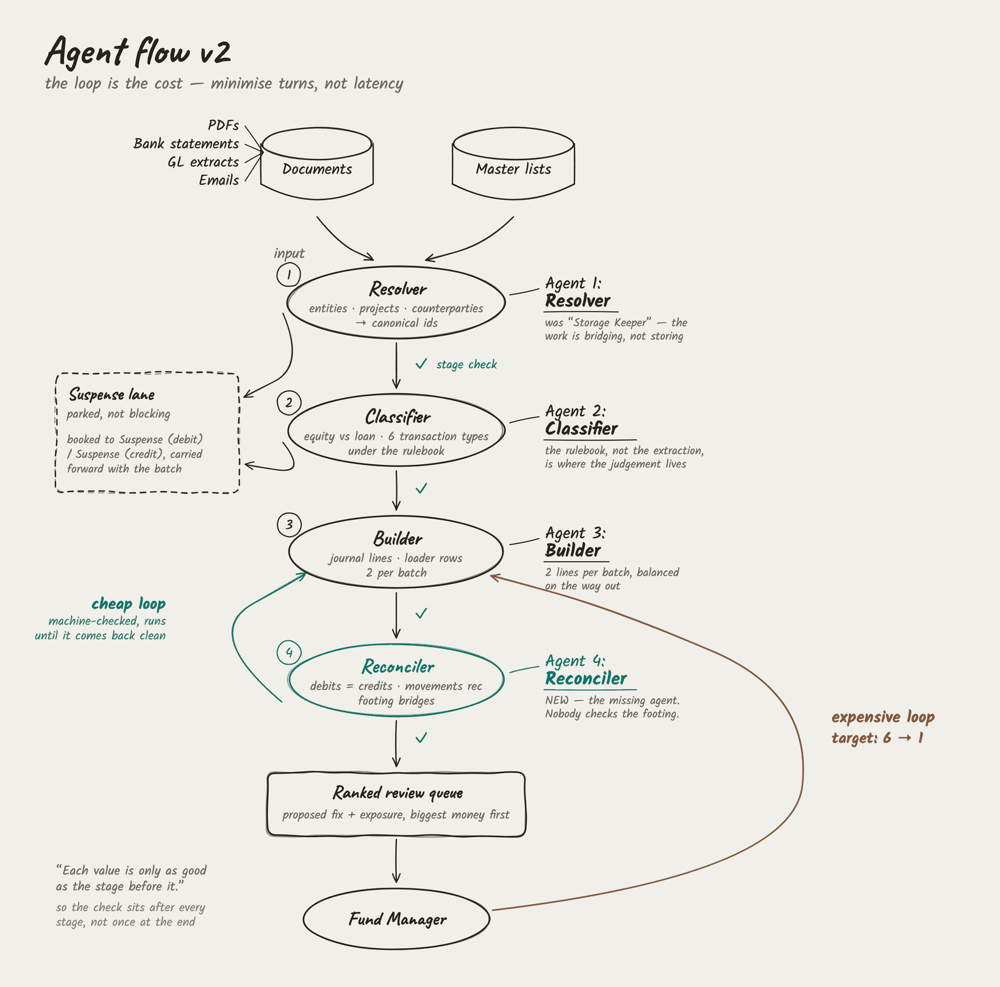

# CrazyMonkey

  [](https://www.ylookup.ai/)
  
  
  
  
  
  

CrazyMonkey [https://crazymonkey-live.vercel.app] is a hackathon product for fund managers and investment teams. It helps transform messy investment documents into clean, model-ready datasets.

The MVP focuses on the part of the research pipeline before IC materials: taking PDFs, statements, NAV packs, portfolio reports, and similar files, then extracting traceable structured data that analysts can validate and export.

## Product Agenda

- Ingest messy documents such as PDFs, financial statements, NAV packs, and investor reports.
- Extract raw text, tables, periods, entities, metrics, and source references.
- Normalize values into consistent schemas for modeling.
- Give users a review workflow for low-confidence fields.
- Export clean CSV, Excel, or JSON datasets.

## MVP Workflow

1. Upload a messy fund document.
2. Classify the document type.
3. Extract tables and key financial metrics.
4. Normalize fields, dates, units, currencies, and entities.
5. Review extracted values with source snippets or page references.
6. Export a modelable dataset.

## Pipeline Architecture



Four agents take a document from raw statement to posted journal lines, with a
deterministic check after every stage rather than one at the end. The working
file this was drawn from puts the reason plainly: *"each value is only as good
as the stage before it."*

| Agent | Does | Checked by |
|---|---|---|
| **1 Resolver** | Bridges the bank's truncated, wrapped, upper-case names to canonical entities, projects and counterparties | provenance, membership |
| **2 Classifier** | Applies the rulebook — six transaction types, and equity versus loan | vocabulary, pairing, review rate |
| **3 Builder** | Resolves the position and writes the double entry, two lines per batch | double entry, posting |
| **4 Reconciler** | Proves the output foots before a human sees it | universe, aggregate, stage tie |

Two things the drawing is making a point about:

**The suspense lane.** Rows that do not resolve are booked to suspense and
carried forward, not dropped and not guessed. Unmatched is a third outcome
beside pass and fail, because in the supplied week 52 of 100 rows genuinely
have no counterparty match.

**The two loops are not the same cost.** The machine loop is cheap and runs
until the arithmetic comes back clean. The review loop costs a day or two of a
fund manager's time per pass, and the last NAV took six of them. Everything
above the review queue exists to reduce that count, which is why turn count is
the metric rather than latency.


## Team Agenda

### Teammate 1: Document Ingestion

- Own upload and file handling.
- Extract text and tables from PDFs.
- Add OCR fallback for scanned documents if time allows.
- Preserve source metadata such as file name, page, and table location.

### Teammate 2: Data Normalization

- Define canonical schemas for fund and portfolio data.
- Map messy labels to standardized metric names.
- Normalize dates, currencies, signs, units, and periods.
- Add validation rules and export formats.

### Teammate 3: AI Extraction

- Build prompts or extraction calls for document classification and key fields.
- Add confidence scoring and uncertainty flags.
- Return source-linked values for human review.
- Avoid summary-only output; focus on auditable numbers.

### Teammate 4: Frontend and Demo

- Build the upload and processing dashboard.
- Display extracted tables and review states.
- Add edit, accept, reject, and export actions.
- Own demo story, submission flow, and fallback demo assets.

## Suggested Repo Structure

```text
backend/
  app/
    ingestion/
    extraction/
    normalization/
    schemas/
frontend/
  src/
samples/
outputs/
```

## Hackathon Milestones

- Hour 0-2: Repo setup, schema definition, sample documents.
- Hour 2-6: File upload, raw extraction, first JSON output.
- Hour 6-12: AI extraction and normalization pipeline.
- Hour 12-18: Review UI and export workflow.
- Hour 18-24: Polish demo, README, slides, and submission.
